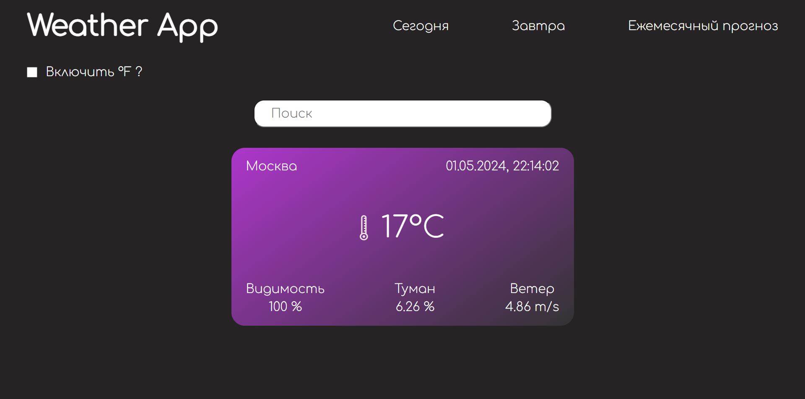

# Weather app

Weather-app - приложение, показывающее актуальные погодные данные, такие как:

1. Градусы
2. Ветер
3. Влажность
4. Состояние (например Снег)

## Запуск проекта

1. Установить зависимости - `npm install`
1. Запустить проект - `npm run dev`

## Перед запуском

1. Создать .env в корне проекта

```bash
# Содержимое .env.
NEXT_PUBLIC_API_KEY=example # Замените на свой API KEY из https://home.openweathermap.org/api_keys
NEXT_PUBLIC_API_URL=https://api.openweathermap.org/data/2.5/weather
```

> Заменить API_KEY в .env файле.

## Предпросмотр


